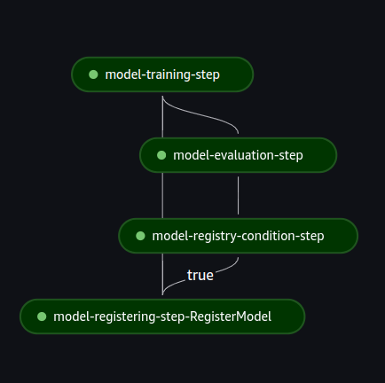
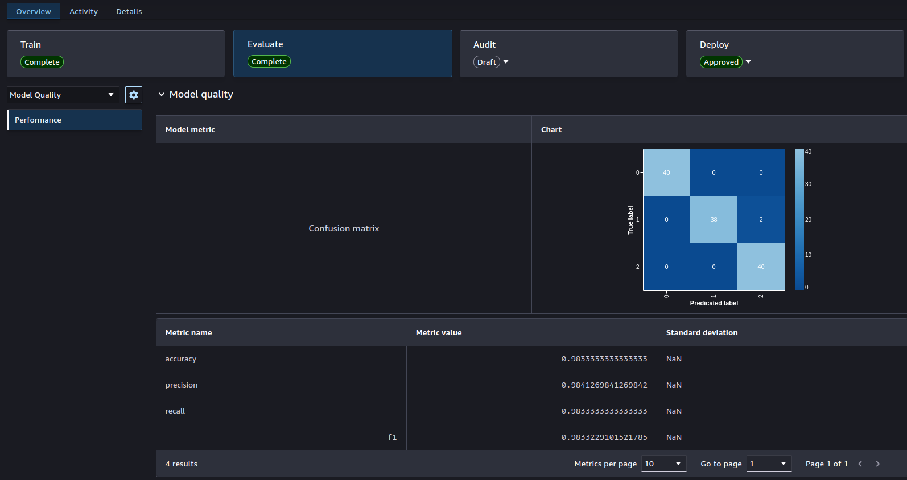
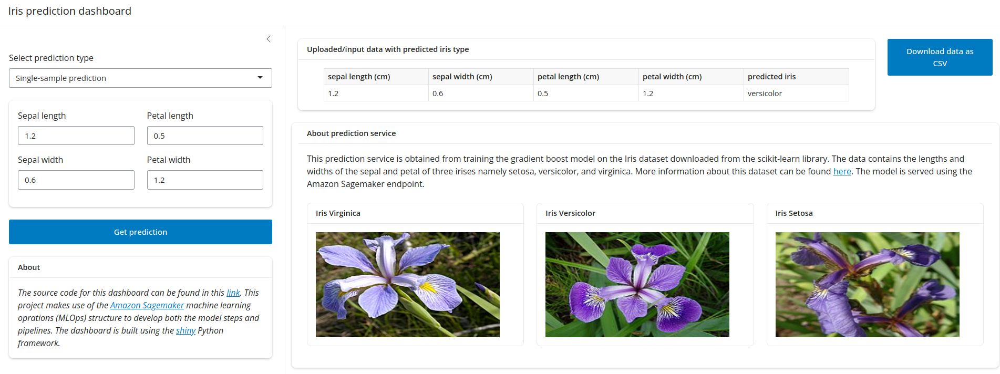
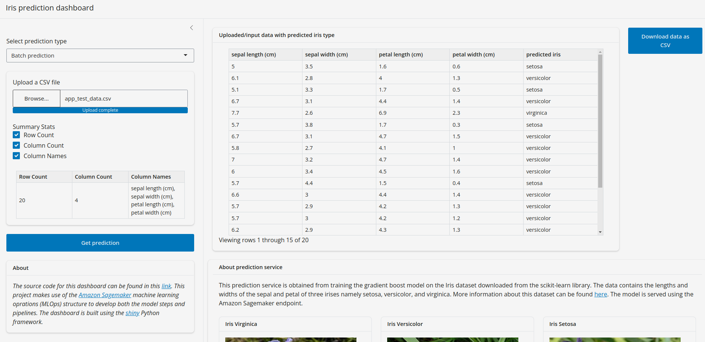

# e2e-mlops
This is e2e-mlops! An end-to-end modularised machine learning operations project using [Amazon Sagemaker](https://github.com/aws/sagemaker-python-sdk) resources. It _ingests_ cleaned train and test data to an amazon s3 bucket, _trains_ a classification model from scratch, _evaluates_ the model, _registers_ the model in model registry if a specified performance metric threshold is meant, and _deploy_ the latest registered model to an _endpoint_ either in serverless or real-time mode. Inferences can be made via a web app built using Python [shiny](https://shiny.posit.co/py/).

## Motivation
I have seen many end-to-end machine learning projects online but most of them use notebooks from model training to deployment. They are desihned for either exploration or experimentation in mind without considering production settings. The challenges with this appraoch is that it is difficult to achieve continuous training and deployment, configuration flexibility, extensibility, testing, reproducibility, and ease of use. This project is built to solve these challenges by using _steps_ and _pipelines_. The summary of this approach is thus: various _pipeplines_ (such as data ingestion and model training) call specific _steps_ (such as data uploader and model trainer), and these _steps_ make use of one or more _scripts_ which are designed to be run in the Amazon Sagemaker. The _pipelines_ can be triggered from a local developement terminal using CLI or via GitHub workflows.   


## Set up
### Infrastructure
This project uses Amazon Sagemaker resources and thus need to be set up.

    1. If not already created, create AWS account. After that, create a user account for the project and give it an administrative access. Download the user's access token keys and save it somewhere, this will be used to configure aws CLI.
    1. Download and configure [aws cli](https://docs.aws.amazon.com/cli/latest/userguide/getting-started-install.html) with the user's access token keys above.
    1. Create a sagemaker execution role to give full access to sagemaker to use AWS resources
    1. This project also uses the the functionalities of Sagemaker Studio to view pipeline runs, metric comparison in the model registry, and endpoint configureations. Thus, you need to enable Sagemaker Studio by creating a sagemaker domain. You can find 'Domains' under 'Admin configurations' in the Amazon Sagemaker menu. 
    1. Create a  new S3 bucket, this will be the location of all inputs and outputs of any pipeline runs. Note that the name must start with "sagemaker" (e.g. sagemaker-my-project-name).
Now we are done with the basic AWS infrastructure configurations


### Local development environment set up
1. Clone this repository by running
    ```
    git clone https://github.com/Rasheed19/e2e-mlops.git
    ```
1. Navigate to the root directory, create a python virtual environment, and activate it by running
    ```
    python3 -m venv .venv
    source .venv/bin/activate
    ``` 
1. Prepare all modules by running 
    ```
    pip install --upgrade pip
    pip install -r requirements.txt
    ```
1. Create a file named `.env`. This is where all environment variables will be stored (you don't want to expose sagemker role ARN and your bucket name!). Define the following enviroment variables inside `.env`:
    ```
    ROLE="the sagemaker execution role arn created when setting up AWS infrastructure"
    S3_BUCKET_NAME="your bucket name"
    ```
Now, we are done with the set up; on to usage.

## Usage
As described above this project is broken down into pipelines which allow for reproducibulity, customization and ease of use. The following are the various pipelines that can be run from your local development environment.
1. `ingestion`, run the ingestion pipeline to ingest the cleaned training and test data into the created S3 bucket:
    ```
    python run.py --pipeline ingestion
    ```
    Note that if the above command is executed the next time; you will be notified that the training and test data already exist in the S3 bucket. If you want to overide the existing uploaded data, give the `--force-upload` flag:
    ```
     python run.py --pipeline ingestion --force-upload
    ```

1. `training`, run the training pipeline to train, evaluate and register model in the Amazon Sagemaker model registry (and tag it 'Pending Approval'):
    ```
    python run.py --pipeline ingestion
    ```
    Note that when you trigger the training pipeline, the job will be submitted immediately to the Amazon Sagemaker. A successfully run training pipeline DAG will look like this (check the 'Pipeline' section of the Sagemaker Studio):

    

    The model performance (and other hyperparameters) can be viewed from the 'Model' section of the Sagemaker Studio. A sucessfully registered model performance will look like this:

    
    If this is not shown under 'Evaluate', then you need to apply [this settings](https://stackoverflow.com/questions/78433959/sagemaker-custom-model-metrics-from-eval-pipeline-step) to your CORS configuration.

1. `deployment`, run the deployment pipeline to deploy the latest registered model in the model registry. By running this pipeline, the model approval status tag wil be changed from 'Pending Approval' to 'Approved' in the model registry. In fact, endpoint creation job will be submitted to the Amazon Sagemaker and you will be able to see its progress by checking the Amazon Sagemaker UI under 'Endpoint'. Below is the command to trigger model deployment:  
   ```
    python run.py --pipeline deployment
    ```
    Note that the above command will deploy the model in real-time mode. If you want to deploy the model in serverless model, please give the `--serverless` flag:
    ```
    python run.py --pipeline deployment --serverless
    ```
    If you are interested in knowing the difference between these two modes, you can check this [link](https://docs.aws.amazon.com/sagemaker/latest/dg/deploy-model.html).

1. `inference`, the running deployment service can be now be used for making predictions. Here, I implemented two scenarios:
    i. via running inference pipeline against a data in the s3 bucket. The predictions will also be saved in the designated s3 path (you can configure the input and output s3 prefixes in the `configs/inference_config.yaml` file). You need to give the name of the inference file in the s3 output prefix which must be of the form '*.csv' (i.e., the file must be in `.csv` format). Here is the command for the case of running inference on a file named `test.scv` in the s3 output prefix:
    ```
    python run.py --pipeline inference --inference-file test.csv
    ```
    
    i. via an interactive app. I built a shiny app which makes use of the deployed endpoint to make predictions. Start the app locally by running
    ```
    shiny run app.py
    ```
    You can make a single-sample prediction, which looks like this:

    

    or upload a `csv` file that contains the features to be predicted. In this case, the UI looks like this: 
    

Note: you can fully customize both the infrastructure and model configurations by using `infrastructure_config.yaml`, `model_config.yaml`, and  `inference_config.yaml`in the `configs` directory.

1. `cleanup`, run the cleanup pipeline to *DELETE* all the pipeline run inputs and outputs, models in the model registry, and deployed endpoints. Note that this pipeline will recursively delete all the contents of the S3 bucket you created during infrastructure set up.


## License
This project is made available under MIT License and it is availabel for use without any restriction. If you find this project useful, please leave a star!
