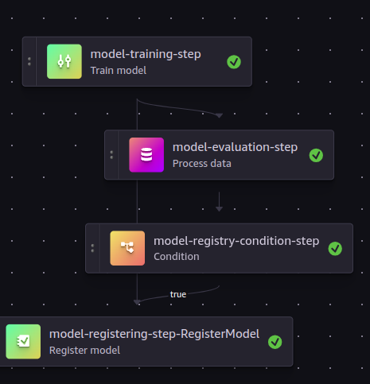

# e2e-mlops
This is e2e-mlops! An end-to-end modularised machine learning operations project using [Amazon Sagemaker](https://github.com/aws/sagemaker-python-sdk) resources. It _ingests_ cleaned train and test data to an amazon S3 bucket, _trains_ a classification model from scratch, _evaluates_ the model, _registers_ the model in model registry if a specified performance metric threshold is met, and _deploy_ the latest registered model to an _endpoint_ either in a serverless or real-time mode. Inferences can be made via a web app built using Python [shiny](https://shiny.posit.co/py/) or by running an inference pipeline against a data in S3 bucket for a batch prediction. _Data_ and _model_ _drift_ monitoring in production are also implemented using the Sagemaker data capture and [Evidently AI](evidentlyai.com).

## Motivation
I have seen many end-to-end machine learning projects that use Amazon Sagemaker but most of them use notebooks from model training to deployment. They are designed for either exploration or experimentation in mind without considering production settings. The challenges with this approach is that it is difficult to achieve continuous training and deployment, configuration flexibility, extensibility, testing, reproducibility, and ease of use. This project is built to solve these challenges by using _steps_ and _pipelines_. The summary of this approach is thus: various _pipeplines_ (such as data ingestion and model training) call specific _steps_ (such as data uploader and model trainer), and these _steps_ make use of one or more _scripts_ which are designed to be run in the Amazon Sagemaker. The _pipelines_ can be triggered from a local developement terminal using CLI or via GitHub workflows.


## Set up
### Infrastructure
This project uses Amazon Sagemaker and Evidently AI resources and thus need to be set up.

1. If not already created, create an AWS account. After that, create a user account for the project and give it an administrative access. Download the user's access token keys and save it somewhere, this will be used to configure aws CLI.
1. Download and configure [aws cli](https://docs.aws.amazon.com/cli/latest/userguide/getting-started-install.html) with the user's access token keys above.
1. Create a sagemaker execution role to give full access to sagemaker to use AWS resources. So far, `AmazonS3FullAccess` and `AmazonSageMakerFullAccess` permision policies work just fine.
1. This project also uses the functionalities of Sagemaker Studio to view pipeline runs, metric comparison in the model registry, and endpoint configurations. Thus, you need to enable Sagemaker Studio by creating a sagemaker domain. You can find 'Domains' under 'Admin configurations' in the Amazon Sagemaker menu.
1. Create a  new S3 bucket, this will be the location of all inputs and outputs of any pipeline runs. Note that the name must start with "sagemaker" (e.g. sagemaker-my-project-name).
1. For data and model drift monitoring in production, create an  [Evidently AI](evidentlyai.com) account. Create a project and generate an API token and project ID.

Now we are done with the basic AWS infrastructure and Evidently AI configurations.


### Local development environment set up
1. Clone this repository by running
    ```
    git clone https://github.com/Rasheed19/e2e-mlops.git
    ```
1. Navigate to the root directory, create a python virtual environment, and activate it by running
    ```
    uv venv .venv --python 3.12.3
    source .venv/bin/activate
    ```

    > New in version 0.2.1. `uv` is now chosen as the default project and enviroment management.
    >
    > Python 3.12.3 is used in this version but Python >=3.11 should work just fine.

1. Run:
    ```
    make setup
    ```
    This will install all dependencies. You will be prompted to insert the Sagemaker execution `ROLE` and `S3_BUCKET_NAME`. After this, a file named `.env` will be created and populated with the role and S3 bucket name. This is where all environment variables will be stored (you don't want to expose sagemker role ARN and your bucket name!).

1. Add the Evidently AI `EVIDENTLY_API_TOKEN` and  `EVIDENTLY_PROJECT_ID` to the created `.env` file.

Now, we are done with the set up; on to usage.

## Usage
As described above, this project is broken down into pipelines which allow for reproducibility, customization and ease of use.

A CLI tool is built to run these pipelines.

We call this tool `e2e`.

To see all the available commands in this tool, run

```
e2e --help
```


We break down each of the commands in the tool as follows.

1. `train`, run the training pipeline to ingest data to S3, train, evaluate and register model in the Amazon Sagemaker model registry (and tag it 'Pending Approval'):
    ```
    e2e train
    ```
    Note that if the above command is executed the next time; you will be notified that the training and test data already exist in the S3 bucket and thus data ingestion step will be skipped. If you want to overide the existing uploaded data, give the `--force-upload` flag:
    ```
    e2e train --force-upload
    ```
    Note that when you trigger the training pipeline, the job will be submitted immediately to the Amazon Sagemaker. A successfully run training pipeline DAG will look like this (check the 'Pipeline' section of the Sagemaker Studio):

    

    The model performance (and other hyperparameters) can be viewed from the 'Model' section of the Sagemaker Studio. A sucessfully registered model performance metrics will look like this:

    
    If this is not shown under 'Evaluate', then you need to apply [this settings](https://stackoverflow.com/questions/78433959/sagemaker-custom-model-metrics-from-eval-pipeline-step) to your CORS configuration.

1. `deploy`, run the deployment pipeline to deploy the latest registered model (with an approval status 'Approved') in the model registry. Before running this pipeline, the model approval status tag must be changed from 'Pending Approval' to 'Approved' in the model registry. Endpoint creation job will be submitted to the Amazon Sagemaker and you will be able to see its progress by checking the Amazon Sagemaker UI under 'Endpoint'. Below is the command to trigger model deployment:
   ```
    e2e deploy
    ```
    Note that the above command will deploy the model in real-time mode. If you want to deploy the model in serverless model, please give the `--serverless` flag:
    ```
    e2e deploy --serverless
    ```
    > Note that deploying model in severless mode does not currently support data capture, thus, data and model drift monitoring cannot be performed.

    If you are interested in knowing the difference between these two modes, you can check this [link](https://docs.aws.amazon.com/sagemaker/latest/dg/deploy-model.html).

1. `inference`, the running deployment service can now be used for making predictions. Here, two scenarios are implemented:

    - via running inference pipeline against a data in the S3 bucket. The predictions will also be saved in the designated S3 path (you can configure the input and output S3 prefixes in the `utils/constants.py` file). You need to give the name of the inference file in the S3 input prefix which must be of the form '*.csv' (i.e., the file must be in `.csv` format) and the name of the deployed endpoint. Here is the command for the case of running inference on a file named `inference.csv` in the S3 input prefix using the entrypoint:
    ```
    e2e inference iris-prediction-endpoint-2024-11-07-18-34-11 inference.csv
    ```
    > The first arg is the name of the deployed endpoint. Run
    >
    > e2e inference --help
    >
    > to see more information about this command.

    - via an interactive app. A shiny app is built which makes use of the deployed endpoint to make predictions. Start the app locally by running
    ```
    shiny run app.py
    ```
    You can make a single-sample prediction, which looks like this:

    

    or upload a `csv` file that contains the features whose labels are to be predicted. In this case, the UI looks like this:

    

1. `datadrift`, run the data drift monitoring to compare the distribution of the training data and the captured data from the deployed endpoint. You need to provide the deployed endpoint name. An example of its usage is the following:
    ```
    e2e datadrift iris-prediction-endpoint-2024-11-07-18-34-11
    ```
    > iris-prediction-endpoint-2024-11-07-18-34-11 is a sample name of a deployed endpoint.

    Upon running the pipeline, a report will be created and uploaded to Evidently AI cloud. Log in to play around with the report.

1. `modeldrift`, run the model drift monitoring to compare the performance of the deployed endpoint on the test data to a given current data stored in S3. You need to provide the deployed endpoint name and a complete S3 uri to the current data. An example of its usage is the following:
    ```
    e2e modeldrift iris-prediction-endpoint-2024-11-07-18-34-11 s3://path-to-current-reference-data
    ```
    > The first arg is the endpoint name and the secomd arg is the S3 uri to the current data.

    Upon running the pipeline, a report will be created and uploaded to Evidently AI cloud. Log in to play around with the report.

1. `clean`, run the cleanup pipeline to **DELETE** all the pipeline run inputs and outputs, models in the model registry, and deployed endpoints. Note that this pipeline will recursively delete all the contents of the S3 bucket you created during the infrastructure set up. To run it, use this command:
    ```
    e2e clean
    ```

> Note: you can fully customize both the infrastructure and model configurations in `utils/constants.py`.
> To see more information or options available to a command simply run
>
> e2e [COMMAND] --help
>
> where COMMAND is one of the above-mentioned commands.

## CI/CD
The `train` and `deploy` pipelines can be triggered via GitHub workflows. The configurations for these workflows are included in `.github/workflows`, which are fully customisable to your needs. These workflows are guidelines and similar configurations can be done for other pipelines.
> New in version 0.2.1: uv is now the default in setting up, building and deploying the project.

## License
This project is made available under MIT License and it is available for use without any restriction. If you find this project useful, please leave a star!
